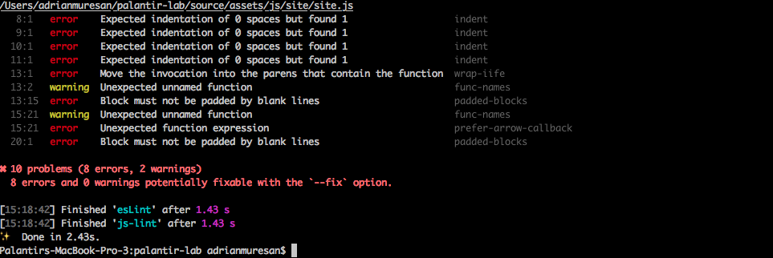
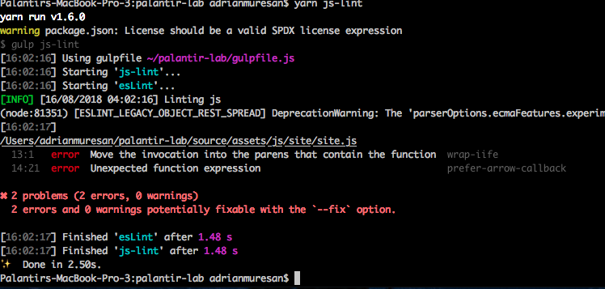

## JS Lint
JS lint uses eslint to help keep our js clean, consistent and error free. Additionally, it provides coverage for React which may have a use case in future projects.

### [List of Rules](https://github.com/palantirnet/palantir-lab/blob/develop/.eslintrc)

### Notes

* Rules can always be overridden or added in the `.eslintrc` file under rules from [ESLint](http://eslint.org/docs/rules/).

#### Example of a `js-lint` test with errors and warnings

  

#### Example of the same `js-lint` test with errors and warnings with some of the errors resolved

  
