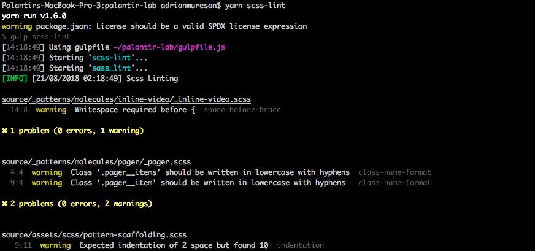
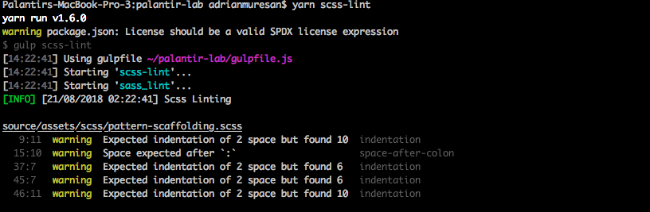

## SCSS Lint
SCSS lint helps us ensure that our scss is clean, consistent, and error free.

### Notes
* The package [stylelint](https://www.npmjs.com/package/stylelint) uses [stylelint-scss](https://www.npmjs.com/package/stylelint-scss) to lint scss files.

### [List of Rules](https://github.com/palantirnet/palantir-lab/blob/develop/.stylelintrc.yml)

* A complete description of all the rules for stylelint scss can be found [here](https://github.com/stylelint/stylelint/blob/6ad94ac7253a01c31b69c1a183eeb9d4daa5f104/docs/user-guide/rules/list.md).

#### Example of task run with some warnings
  

#### Example of task with some of the warnings resolved
* as we can see the warnings in the `_inline-video.scss` and `_pager.scss` files are gone.

